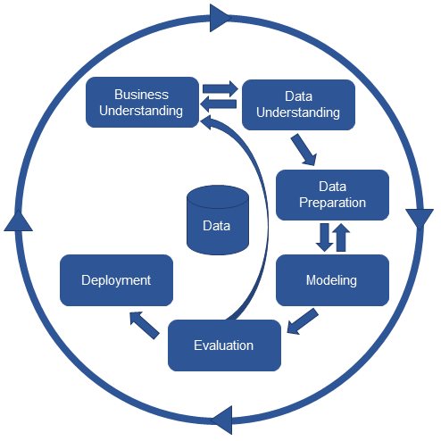

# CommonLit-Readability-Prize-Python

## Contenuto

- [ibm_whatson_api](./ibm_whatson_api)
    > Script per convertire i testi in dati strutturati, utilizzando le API di IBM Whatson.
    > Il file `ibm_whatson_api/ibm_credentials.json` contiene delle credenziali per
    > utilizzare le API.  
    > Tuttavia queste ultime sono **limitate** quindi evitate di utilizzarle se
    > non strettamente necessario.

- [ml_model](./ml_model)
    > Modello di Machine Learning per la competizione.
